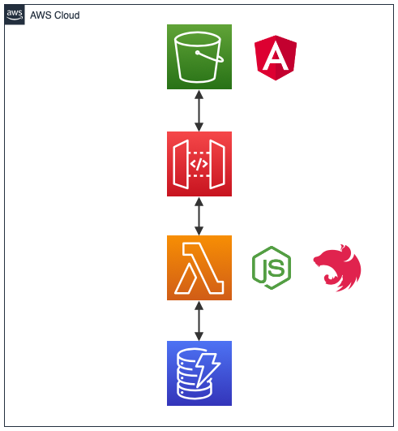

# Nopanic

Nopanic est un tableau de bord permettant de visualiser les déploiements de vos applications au sein de vôtre SI.

Idéalement, Nopanic est à intégrer au sein de votre **CD**, à chaque déploiement il faut déclencher une requête HTTP POST pour enregistrer un nouveau déploiement et mettre à jours le tableau de bord.

## Architecture Technique

### Front
Le front est développé en Angular avec l'utilisation de la librairie Nebular pour le design. Il est hébergé dans un bucket S3.

• https://angular.io/  
• https://akveo.github.io/nebular/  
• https://aws.amazon.com/fr/s3/  

### Back
L'API a été développée en Node JS avec le framework Nest JS. 

Le code est exécuté à la demande via une Lambda. L'API est exposée via une API Gateway.

• https://nodejs.org/en/  
• https://nestjs.com/  
• https://aws.amazon.com/fr/lambda/  
• https://aws.amazon.com/fr/api-gateway/  

### Base de données
La base de données utilisée est une Dynamo DB.

• https://aws.amazon.com/fr/dynamodb/  

## Installation